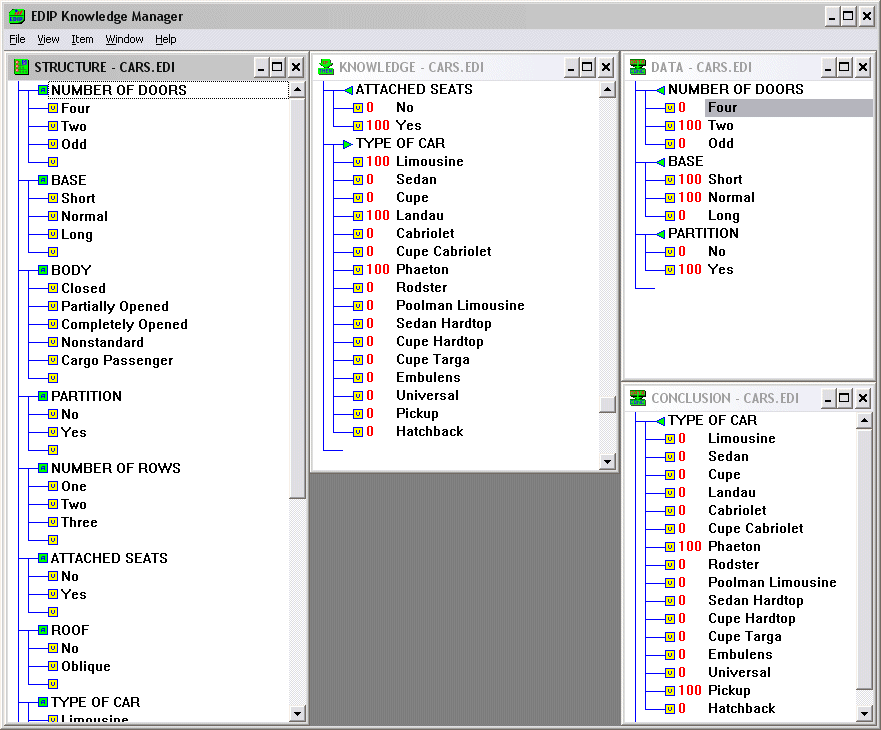

# Expert System Shell EDIP for Windows

Expert system shell EDIP is intended for creating expert systems in ssome problem domain by defining a set of rule.

## Author

Alexandr Savinov 
* http://conceptoriented.org/savinov
* https://www.researchgate.net/profile/Alexandr_Savinov
